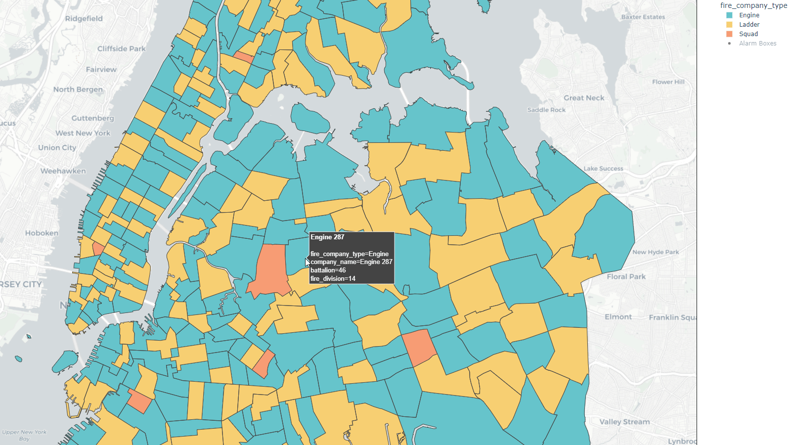

# Python Term Project for CSC110

Mapping the average response times for the Fire Department of the City of New York before and during Covid19. Average response time plot shows monthly response time data in seconds from April 2018 to April 2021 (As of the time of this project, FDNY Incident response data is only available up to May 5th 2021).

Pimarily uses **Plotly**, **Pandas**, and **Shapely** in **Python 3.9.6** to organize and calculate average incident response times by month
separated by FDNY company divisions (boundaries for different units as given in [this dataset](https://data.cityofnewyork.us/Public-Safety/Fire-Companies/iiv7-jaj9 "OpenData FDNY Fire Company Boundaries")). Incident response data location is given in the form of alarm boxes (either FDNY physical or historical pull-alarm boxes located around intersections in nyc or private/nonphysical alarm boxes, like subway stations or businesses, connected to the FDNY system).

Not intended to be a standalone app; You can either run the python main file or view the given output files in the [output directory](https://github.com/JLenander/CSC110_project/tree/main/output "Go to output directory"). By default the code will pull from the preprocessed data in data/processed to generate the plots. See commented instructions for other options.

Due to geocoding limitations, not every incident in the dataset is represented as not every alarm box in incidents is still active and the dataset for the alarm boxes only shows active alarm box locations. From what I understand, bulk geocoding (figuring out the Longitude/Latitude based off of street intersections like "2nd ave & E 7th st") is not easy for free.

Data from the [NYC Open Data portal](https://opendata.cityofnewyork.us/). Project processes 4,000,000+ lines of data.

# Sample Plots:
### Alarm Box Locations

### Average Response Times Animated by month

### Fire Company Boundaries + Alarm Box Locations

### 50% Transparency Company Boundaries + Alarm Box Locations

